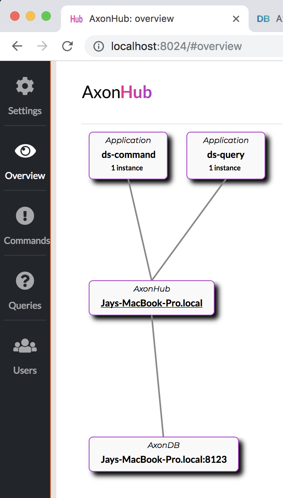

# axon-dutch-school-docker


## Pre-requisites
- Java 8
- Docker

## Running the application

1. Update the axonhub.properties

```shell
docker-compose up --build
```

You can verify the setup by opening Axon Hub url. You should see an overview similar to the following image.
 



## Useful links - Local Server

- [Axon Hub](http://localhost:28024)
- [Axon DB](http://localhost:18023)
- [DS GUI](http://localhost:38080)
